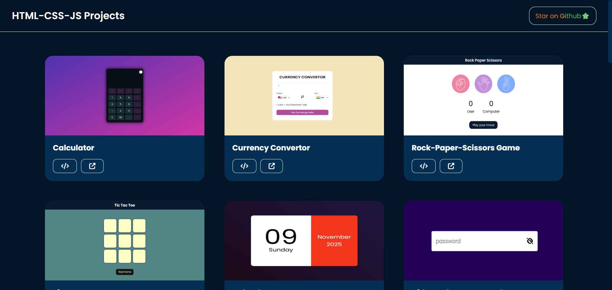

# 🚀 HTML, CSS & JavaScript Mini Projects Website


Welcome to my **Mini Projects Website**, a curated collection of **HTML, CSS & JavaScript** projects built to sharpen my front-end development skills. 🎨💻
Every project includes an **image preview, source code link**, and **live demo** — making it easy to learn, explore, and interact.

This repo is a major milestone in my journey to master **JavaScript logic, UI/UX design**, and **web development fundamentals**. 🚀🔥

---

## 📌 Overview  

This website is designed to:  
✅ Showcase **each project** with a preview image  
✅ Provide **live deployment links** for direct interaction  
✅ Offer **source code access** for easy learning  
✅ Feature **JS animations** with ScrollReveal for smooth effects  
✅ Ensure **full responsiveness** for all projects  
✅ Include a **Back-to-Top button** for seamless navigation  
✅ Have a **footer with useful resources**  

Built to help beginners explore and learn front-end development interactively! 🌱  

---

## 📸 Screenshots  

  

---

## 🌐 Live Demo  

The project is live and can be viewed here: [HTML, CSS & JS Mini Projects Website](https://html-css-js-projects-five.vercel.app/)  

---

## 🛠 Technologies Used  

- **🌍 HTML5** – Structuring web pages  
- **🎨 CSS3** – Styling, animations, and layouts  
- **⚡ JavaScript** – Logic, interactions, and functionalities  
- **📜 ScrollReveal.js** – Smooth animation effects  
- **🖊️ VS Code** – Primary code editor  
- **🐙 Git & GitHub** – Version control and hosting  

---

## 📂 Projects Listed  

Each project includes:  
📸 **Image Preview** | 📜 **Code Link** | 🔗 **Live Demo**  

---

## 📂 Projects  


> **Utility & Interactive Tools**  

1. **Calculator** – A basic calculator with JavaScript functionality.  
2. **Currency Converter** – Convert between different currencies dynamically.  
3. **Rock-Paper-Scissors Game** – A fun interactive game with JavaScript logic.  
4. **Tic-Tac-Toe Game** – Classic two-player tic-tac-toe game.  
5. **Calendar** – A simple calendar display with JavaScript.  
6. **Hide and Show Password** – A toggle button to show/hide passwords.  
7. **Coming Soon Page with Launch Countdown** – A stylish countdown timer for upcoming events.  
8. **Digital Clock** – A live digital clock displaying the current time.  
9. **Random Password Generator** – Generate secure random passwords.  
10. **Password Strength Indicator** – Visual indicator for password strength.  
11. **Random Quote Generator** – Get a new random quote with each click.  
12. **Drag and Drop Items** – A simple drag-and-drop functionality.  
13. **QR Code Generator** – Generate QR codes from input text.  
14. **Select Menu Design** – Custom-styled dropdown select menus.  
15. **Text-to-Speech Converter** – Convert written text into spoken words.  
16. **Age Calculator** – Calculate your age based on input birthdate.  
17. **Toast Notification** – A simple toast notification popup.  
18. **Stopwatch** – A functional stopwatch with start, stop, and reset.
19. **To-do list** - A functional to-do list app to add tasks.
20. **Weather App** - A weather app to display weather of different cities.
21. **Image search engine** - An image search engine using unsplash API.
22. **From validation** - A form with validation checks to make sure the input is valid.
23. **Notes App** - a notes app to create multiple notes.

---

## 🌟 Why This Project Exists

This collection is part of my #100DaysOfCode journey. <br />
Each project helped me strengthen a specific concept — from DOM manipulation and API calls to responsive design and user interactions.

---

## ⚙️ Prerequisites  

Before running the projects, ensure you have the following installed:  

- 🖥️ **A modern web browser** (Chrome, Firefox, Edge, etc.)  
- 📝 **VS Code** (or any code editor)  
- 🌐 **Git** (optional, for cloning the repository)  

---

## Resources  

These are the resources I used to learn and build these projects:  

- [MDN Web Docs (JavaScript)](https://developer.mozilla.org/en-US/docs/Web/JavaScript)  
- [GreatStack youtube channel](https://www.youtube.com/playlist?list=PLjwm_8O3suyOgDS_Z8AWbbq3zpCmR-WE9)  

---

## 🛠 Installation & Usage  

To use these projects locally, follow these steps:  

1️⃣ **Clone this repository**  
```bash  
git clone https://github.com/TonyStark-19/HTML-CSS-JS-Projects.git
```

2️⃣ **Open a project folder and launch the `.html` file in your browser.**  

🚀 No dependencies required! Just HTML, CSS & JavaScript.  

---

## ⭐ Feedback & Support

If you find this collection helpful, please consider giving the repo a ⭐ star — it motivates me to build more! 🙌 <br />
Feel free to fork, explore, and modify these projects.

---

💡 Built with ❤️ by Aditya chandel
